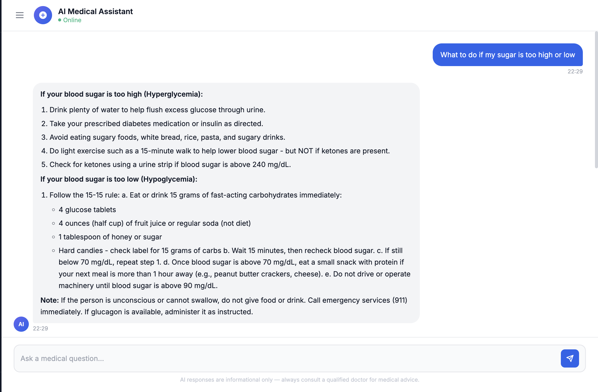

# 🏥 GENAI Smart Medical Chatbot

<div align="center">


**An AI-powered medical assistant that answers health questions using Retrieval-Augmented Generation (RAG), with a full chat history sidebar, conversation memory, and a modern UI.**

[Features](#-features) • [Tech Stack](#-tech-stack) • [Installation](#-installation--setup) • [API Endpoints](#-api-endpoints) • [Deployment](#-deployment)

</div>

---

## 📸 Screenshots

| Chat Interface & Chat History Sidebar |
|---|
| |

---

## ✨ Features

- 🤖 **AI Medical Q&A** — Ask any medical question and get specific, actionable answers
- 💬 **Chat History Sidebar** — Browse and resume previous conversations (like Claude / ChatGPT)
- ➕ **New Chat Button** — Start fresh conversations anytime; previous chats are auto-saved
- 🧠 **Conversation Memory** — Bot remembers context within each session for natural follow-ups
- 🔍 **RAG Pipeline** — Retrieves relevant medical knowledge from Pinecone before generating answers
- 📝 **Markdown Rendering** — Responses display with bold text, numbered lists, and headers
- 🗄️ **Persistent History** — All chats stored in local SQLite database across restarts
- 📱 **Responsive UI** — Collapsible sidebar works on desktop and mobile
- 🚀 **Cloud Inference** — No local GPU needed; uses HuggingFace Inference API

---

## 🛠️ Tech Stack

| Layer | Technology |
|---|---|
| **Backend** | Python 3.9+, Flask 3.0 |
| **LLM** | Llama 3.1 8B Instruct via HuggingFace Inference API |
| **RAG Framework** | LangChain 0.2 |
| **Vector Database** | Pinecone (index: `medical`) |
| **Embeddings** | `sentence-transformers/all-MiniLM-L6-v2` |
| **Chat Storage** | SQLite (local, zero-config) |
| **Frontend** | HTML5, CSS3, JavaScript, jQuery, marked.js, DOMPurify |

---

## 📂 Project Structure

```
GENAI-Smart-Medical-Chatbot/
├── app.py                   # Flask app — routes, RAG chain, SQLite logic
├── store_index.py           # Script to embed documents and populate Pinecone
├── requirements.txt         # Python dependencies
├── setup.py                 # Package setup
├── .env                     # Environment variables (not committed)
├── chat_history.db          # SQLite database (auto-created at runtime)
│
├── data/
│   └── blood_sugar_guide.txt  # Curated medical knowledge (blood sugar management)
│
├── src/
│   ├── helper.py            # PDF loading and text splitting utilities
│   └── prompt.py            # Legacy prompt template
│
├── model/
│   └── instructions.txt     # Model download instructions
│
├── templates/
│   └── chat.html            # Full frontend (sidebar + chat UI)
│
├── static/                  # Static assets (CSS, images)
└── research/                # Notebooks and experiments
```

---

## ⚙️ Installation & Setup

### Prerequisites

- Python 3.9+
- A [HuggingFace](https://huggingface.co/settings/tokens) account (free) with an API token
- A [Pinecone](https://www.pinecone.io/) account (free tier) with an API key

### 1. Clone the repository

```bash
git clone https://github.com/agrawal-2005/GENAI-Smart-Medical-Chatbot.git
cd GENAI-Smart-Medical-Chatbot
```

### 2. Create and activate a virtual environment

```bash
python -m venv venv

# macOS / Linux
source venv/bin/activate

# Windows
venv\Scripts\activate
```

### 3. Install dependencies

```bash
pip install -r requirements.txt
```

### 4. Create your `.env` file

```bash
cp .env.example .env   # or create manually
```

Add the following to `.env`:

```env
HUGGINGFACEHUB_API_TOKEN=your_huggingface_token_here
PINECONE_API_KEY=your_pinecone_api_key_here
```

### 5. Populate the Pinecone index (first time only)

Place any medical PDF files in the `data/` folder, then run:

```bash
python store_index.py
```

> The curated `data/blood_sugar_guide.txt` is already indexed. Only re-run this when adding new documents.

### 6. Run the application

```bash
python app.py
```

Open your browser and visit:

```
http://localhost:8080
```

---

## 🔑 Environment Variables

| Variable | Description | Where to get it |
|---|---|---|
| `HUGGINGFACEHUB_API_TOKEN` | HuggingFace API token for Llama 3.1 inference | [huggingface.co/settings/tokens](https://huggingface.co/settings/tokens) |
| `PINECONE_API_KEY` | Pinecone vector database API key | [app.pinecone.io](https://app.pinecone.io/) |

> ⚠️ Never commit your `.env` file. It is listed in `.gitignore`.

---

## 🔌 API Endpoints

| Method | Endpoint | Description |
|---|---|---|
| `GET` | `/` | Main chat interface |
| `POST` | `/get` | Send a message; returns AI response and `conversation_id` |
| `GET` | `/api/conversations` | List all saved conversations |
| `POST` | `/api/conversations` | Create a new blank conversation |
| `GET` | `/api/conversations/<id>` | Get a conversation with its full message history |
| `DELETE` | `/api/conversations/<id>` | Delete a conversation and all its messages |

### Example: Send a message

```bash
curl -X POST http://localhost:8080/get \
  -F "msg=What is my target blood sugar range?" \
  -F "conversation_id=optional-uuid-here"
```

```json
{
  "response": "For most adults with diabetes, target blood sugar levels are:\n- **Before meals:** 80–130 mg/dL\n- **After meals (2hr):** < 180 mg/dL",
  "conversation_id": "abc123-..."
}
```

---

## 🧠 How It Works

```
User Message
     │
     ▼
┌─────────────────────┐
│  Pinecone Retriever │  ← Finds top-3 relevant medical document chunks
└─────────────────────┘
     │ context
     ▼
┌─────────────────────┐
│   Prompt Builder    │  ← Injects context + last 3 conversation turns
└─────────────────────┘
     │ formatted prompt
     ▼
┌─────────────────────┐
│  Llama 3.1 8B via  │  ← HuggingFace Inference API (no local GPU needed)
│   HF Router API    │
└─────────────────────┘
     │ answer
     ▼
┌─────────────────────┐
│  SQLite + Response  │  ← Saves to DB, renders markdown, returns to UI
└─────────────────────┘
```

---

## 🚀 Deployment

This app requires **no local model download** — inference runs entirely in the cloud via the HuggingFace API.

### HuggingFace Spaces

1. Fork this repo
2. Create a new Space (SDK: Docker or Gradio)
3. Add `HUGGINGFACEHUB_API_TOKEN` and `PINECONE_API_KEY` as Space secrets
4. Push your code

### Render / Railway

1. Connect your GitHub repo
2. Set build command: `pip install -r requirements.txt`
3. Set start command: `python app.py`
4. Add environment variables in the dashboard

> For production, set `debug=False` in `app.py` and use a production WSGI server like **gunicorn**:
> ```bash
> gunicorn -w 2 -b 0.0.0.0:8080 app:app
> ```

---

## 🤝 Contributing

Contributions are welcome!

1. Fork the repository
2. Create a feature branch: `git checkout -b feature/your-feature-name`
3. Commit your changes: `git commit -m "Add your feature"`
4. Push to the branch: `git push origin feature/your-feature-name`
5. Open a Pull Request

Please make sure your code runs without errors before submitting.

---

## 📄 License

This project is licensed under the **MIT License** — see the [LICENSE](LICENSE) file for details.

---

## 👨‍💻 Author

**Prashant Agrawal**

[](https://github.com/agrawal-2005)

---

<div align="center">

⭐ **If you find this project useful, please give it a star!** ⭐

</div>
